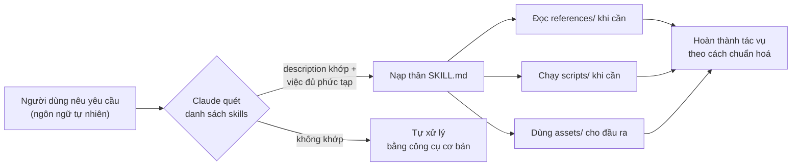
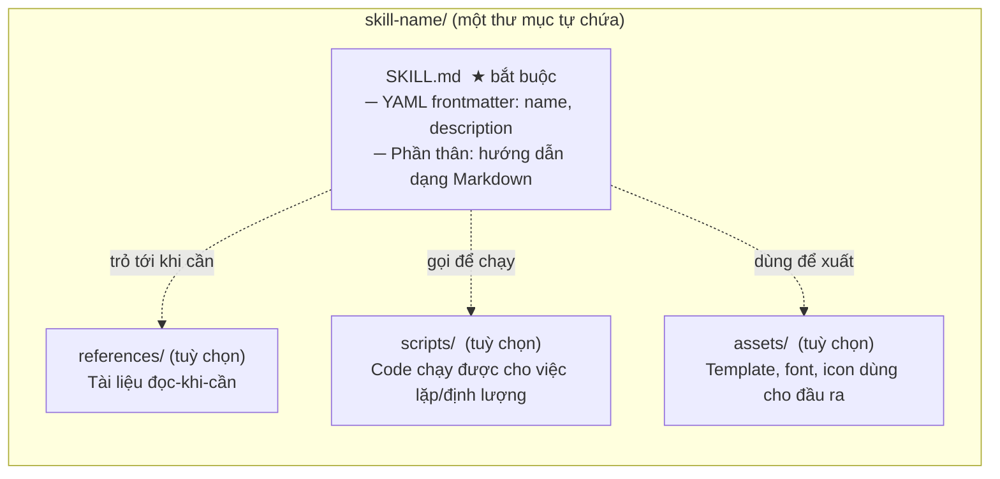
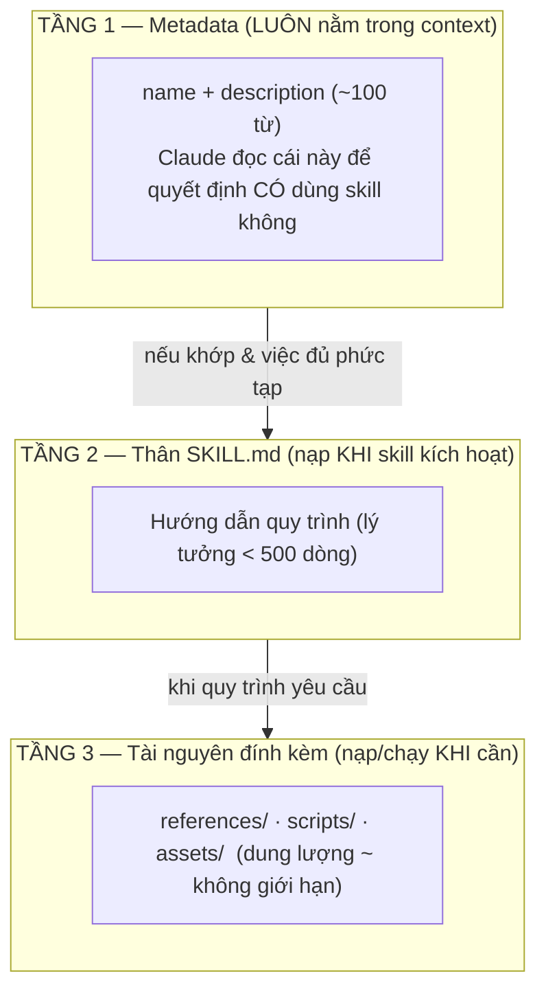
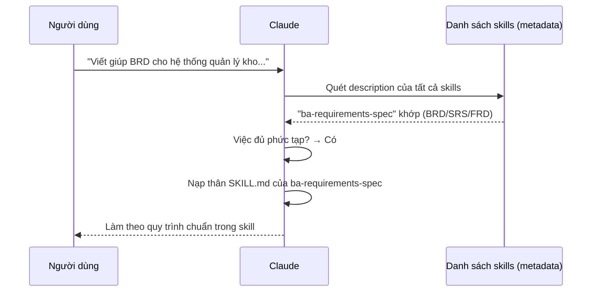
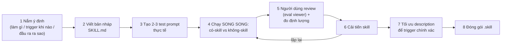
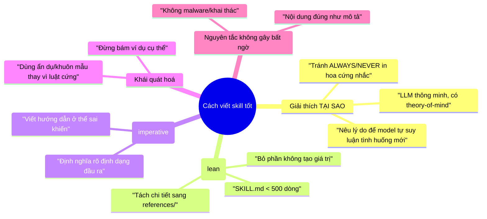
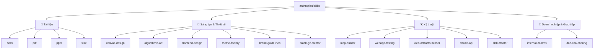
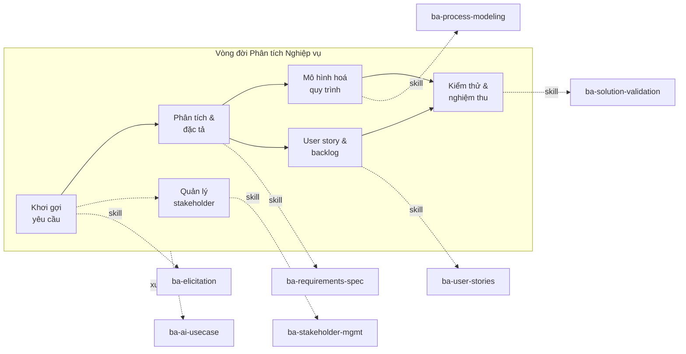

# Agent Skills — Hướng dẫn trực quan (bản đầy đủ cho BA)

> Tài liệu này giải mã **cốt lõi** mà tác giả repo `anthropics/skills` muốn truyền tải, rồi
> chỉ ra cách một **Business Analyst (BA) ứng dụng doanh nghiệp** — vừa là *Agentic AI BA*
> vừa là *IT BA* — vận dụng nó. Đọc xong tài liệu này bạn sẽ trả lời được 3 câu hỏi:
>
> 1. **Skill là gì** và tại sao nó tồn tại?
> 2. Skill **được nạp và kích hoạt** như thế nào (cơ chế kỹ thuật)?
> 3. Làm sao **tự viết** một skill tốt, và áp vào nghiệp vụ BA?

---

## 0. TL;DR trong 60 giây

- **Skill = một thư mục** chứa `SKILL.md` (hướng dẫn + metadata) cùng tài nguyên đính kèm
  (`scripts/`, `references/`, `assets/`). Nó *dạy* Claude làm **một loại việc chuyên biệt theo
  cách lặp lại được** — như "viết tài liệu theo brand công ty", "trích xuất form PDF", "viết BRD".
- Nguyên lý trung tâm là **Progressive Disclosure (tiết lộ tiệm tiến)**: chỉ nạp đúng thứ cần,
  đúng lúc cần — để tiết kiệm "bộ nhớ làm việc" (context) và mở rộng gần như vô hạn.
- **`description` là công tắc kích hoạt**. Viết description tốt = skill được dùng đúng lúc.
- Triết lý viết: **giải thích "tại sao" thay vì ra lệnh cứng nhắc**; giữ gọn; gom việc lặp lại
  thành script dùng chung; lặp *draft → đánh giá (eval) → cải tiến*.



---

## 1. Vấn đề mà Skill giải quyết

Một mô hình ngôn ngữ "trần" rất giỏi việc chung nhưng có 3 điểm yếu khi vào **doanh nghiệp**:

| Điểm yếu của LLM trần | Hệ quả với doanh nghiệp | Skill khắc phục thế nào |
|---|---|---|
| Không biết **quy ước riêng** của tổ chức | Mỗi lần ra một kiểu, không nhất quán | Đóng gói quy ước (template, tone, brand) vào skill |
| **Context có hạn** — nhồi hết tài liệu vào là tốn & loãng | Trả lời lan man, quên chi tiết | Progressive disclosure: chỉ nạp khi cần |
| **Lặp lại** việc dựng công cụ mỗi phiên | Chậm, dễ sai, tốn token | Bundle sẵn `scripts/` để chạy thẳng |

> **Tinh thần của tác giả:** Skill biến Claude từ "trợ lý vạn năng nhưng generic" thành
> "đồng nghiệp đã được *onboard* vào đúng cách làm việc của tổ chức bạn".

---

## 2. Giải phẫu một Skill



**Chỉ `SKILL.md` là bắt buộc.** Trong đó chỉ 2 trường frontmatter bắt buộc:

```yaml
---
name: ten-skill            # định danh, viết-thường-có-gạch-nối
description: Skill làm gì + KHI NÀO Claude nên dùng nó.
---
# Tiêu đề skill
[Hướng dẫn Claude sẽ tuân theo khi skill được kích hoạt]
```

- `scripts/` → việc **xác định/lặp đi lặp lại** (vd: dựng file .docx, kiểm tra form PDF). Quan
  trọng: *script chạy được mà không cần nạp nội dung vào context* → tiết kiệm cực lớn.
- `references/` → tài liệu **đọc-khi-cần** (vd: bảng tra cú pháp, hướng dẫn chi tiết theo từng biến thể).
- `assets/` → **vật liệu đầu ra** (template tài liệu, font, ảnh nền).

---

## 3. Trái tim kỹ thuật: Progressive Disclosure (3 tầng)

Đây là ý tưởng quan trọng nhất của repo. Context của Claude là tài nguyên khan hiếm; skill được
thiết kế để **chỉ tốn context cho thứ thực sự cần ngay lúc đó**.



| Tầng | Khi nào vào context | Ngân sách | Ví dụ |
|---|---|---|---|
| 1. Metadata | **Luôn luôn** | ~100 từ | `name`, `description` |
| 2. Thân SKILL.md | Khi skill **kích hoạt** | < 500 dòng (mềm) | quy trình các bước |
| 3. Tài nguyên | Khi **cần dùng** | gần như vô hạn | `references/aws.md`, `scripts/build.py` |

> **Hệ quả thiết kế:** giữ `SKILL.md` gọn; tài liệu dài/biến thể nhiều thì tách ra `references/`
> và **trỏ rõ** "khi gặp X thì đọc file Y". Đây chính là cách skill `claude-api` hay `mcp-builder`
> trong repo tổ chức nội dung.

**Mẫu tổ chức đa biến thể (domain organization):**

```text
cloud-deploy/
├── SKILL.md            # quy trình chung + cách CHỌN biến thể
└── references/
    ├── aws.md          # chỉ đọc khi triển khai AWS
    ├── gcp.md
    └── azure.md
```

---

## 4. Cơ chế kích hoạt (Triggering) — vì sao `description` là vua

Claude nhìn thấy mọi skill dưới dạng **name + description** trong danh sách `available_skills`,
rồi tự quyết định có "tham vấn" skill đó không. Hai điều cốt yếu:

1. **Description quyết định trigger.** Phải nêu *làm gì* **và** *khi nào dùng* — kèm ngữ cảnh,
   từ khoá, cả khi người dùng **không gọi tên** skill.
2. **Việc phải đủ phức tạp.** Câu hỏi 1 bước ("đọc file PDF này") có thể **không** trigger skill
   vì Claude tự làm được. Skill được tham vấn cho việc nhiều bước/chuyên biệt.



> ⚠️ **Bẫy thường gặp: under-trigger** (skill hữu ích nhưng không được gọi). Tác giả khuyên viết
> description **"hơi pushy"**. So sánh:
>
> - ❌ *"How to build a dashboard for internal data."*
> - ✅ *"How to build a dashboard for internal data. **Use this skill whenever the user mentions
>   dashboards, data visualization, internal metrics, or wants to display any company data — even
>   if they don't explicitly say 'dashboard'.**"*

**Mẫu description tốt** thường có cấu trúc: `[Làm gì] + [TRIGGER khi: ...] + (tuỳ chọn) [SKIP khi: ...]`.
Xem skill `claude-api` và `xlsx` trong repo để thấy mẫu TRIGGER/SKIP rõ ràng.

---

## 5. Vòng đời tạo skill — `skill-creator` (meta-skill)

`skill-creator` là skill *để tạo ra skill khác*. Nó mã hoá một vòng lặp thực nghiệm:



Các ý niệm đáng nhớ từ vòng lặp này (rất hữu ích cho BA khi "đặc tả" bất cứ thứ gì):

- **Baseline so sánh:** luôn chạy *có-skill* cạnh *không-skill* để biết skill có thực sự thêm giá trị.
- **Đừng overfit:** skill phải đúng cho *hàng triệu* tình huống tương lai, không chỉ vài ví dụ test.
- **Đọc transcript, không chỉ kết quả:** nếu nhiều lần test đều tự viết một script giống nhau →
  dấu hiệu nên *bundle* script đó vào skill.
- **Eval = bằng chứng, không phải cảm tính.** Tư duy này trùng khớp với UAT/nghiệm thu của BA.

---

## 6. Triết lý viết skill (rất quan trọng — và rất "BA")

Tác giả nhấn mạnh **văn phong & tư duy**, không chỉ cú pháp:



> Câu trích đáng dán lên tường: *"If you find yourself writing ALWAYS or NEVER in all caps, that's
> a yellow flag — reframe and explain the reasoning."* (Nếu bạn đang viết ALWAYS/NEVER in hoa, hãy
> dừng lại và **giải thích lý do** thay vì ra lệnh.)

Với BA, đây chính là khác biệt giữa một **đặc tả tốt** (nêu *ý định & ràng buộc*, cho phép suy
luận) và một **checklist chết** (liệt kê cứng, vỡ khi gặp tình huống mới).

---

## 7. Bản đồ catalog repo gốc (17 skill)



| Nhóm | Skill | Lõi giá trị |
|---|---|---|
| Tài liệu | `docx`,`pdf`,`pptx`,`xlsx` | Tạo/đọc/sửa tài liệu văn phòng chuẩn (đang chạy production) |
| Sáng tạo | `canvas-design`,`algorithmic-art`,`frontend-design`,`theme-factory`,`brand-guidelines`,`slack-gif-creator` | Thiết kế hình ảnh/giao diện có gu, đúng brand |
| Kỹ thuật | `mcp-builder`,`webapp-testing`,`web-artifacts-builder`,`claude-api`,`skill-creator` | Xây MCP, test web, dựng artifact, dùng API, tạo skill |
| Doanh nghiệp | `internal-comms`,`doc-coauthoring` | Viết comms nội bộ; đồng-soạn tài liệu có quy trình |

> Hai skill `internal-comms` và `doc-coauthoring` là *họ hàng gần nhất* của nghề BA — và là khuôn
> mẫu trực tiếp cho bộ skill BA mà repo này bổ sung (xem mục 8 và tài liệu playbook).

---

## 8. Hiện thực hoá cho vai trò BA doanh nghiệp

Repo gốc thiếu lớp **phân tích nghiệp vụ**. Bộ skill `ba-*` được thêm vào để phủ trọn vòng đời BA
(theo tinh thần BABOK, nhưng tinh gọn để dùng được ngay). Sơ đồ ánh xạ:



| Skill BA | Giai đoạn | Đầu ra chính |
|---|---|---|
| `ba-elicitation` | Khơi gợi | Kế hoạch phỏng vấn/workshop, bộ câu hỏi, biên bản khơi gợi |
| `ba-requirements-spec` | Đặc tả | BRD, SRS/FRD, danh mục NFR |
| `ba-user-stories` | Backlog | Epic, user story, tiêu chí chấp nhận (Gherkin), kiểm INVEST |
| `ba-process-modeling` | Mô hình hoá | Sơ đồ AS-IS/TO-BE (Mermaid), swimlane, phân tích gap quy trình |
| `ba-stakeholder-mgmt` | Xuyên suốt | Bản đồ stakeholder, ma trận RACI, kế hoạch truyền thông, status report |
| `ba-solution-validation` | Nghiệm thu | Ma trận truy vết (RTM), kịch bản UAT, gap analysis, biên bản chấp nhận |
| `ba-ai-usecase` | Xuyên suốt (Agentic AI) | Khung đánh giá use-case AI: khả thi, ROI, mức sẵn sàng dữ liệu, HITL, rủi ro |

Chi tiết cách dùng từng skill (đầu vào, đầu ra, prompt mẫu) nằm ở **[`02-ba-skills-playbook.md`](./02-ba-skills-playbook.md)**.

---

## 9. Cách dùng nhanh trong Claude Code

```text
# Đăng ký marketplace (chạy trong Claude Code)
/plugin marketplace add <repo-này>

# Cài bộ skill BA
/plugin install ba-enterprise-skills@anthropic-agent-skills

# Sau đó chỉ cần nói tự nhiên, skill tự kích hoạt:
"Viết BRD cho hệ thống quản lý kho cho công ty bán lẻ 200 cửa hàng."
"Vẽ quy trình AS-IS rồi TO-BE cho luồng phê duyệt mua hàng."
"Bóc user story + tiêu chí chấp nhận cho module đăng nhập SSO."
```

---

## 10. 7 nguyên tắc để mang đi (cheat-sheet)

1. **Skill = thư mục + `SKILL.md`.** Tự chứa, gói được, chia sẻ được.
2. **Progressive disclosure** — chỉ nạp thứ cần, đúng lúc. Giữ thân gọn, đẩy chi tiết ra `references/`.
3. **`description` là công tắc.** Nêu *làm gì + khi nào*, hơi "pushy", có thể kèm SKIP.
4. **Giải thích TẠI SAO**, đừng ra lệnh cứng. Model thông minh — cho nó lý do để suy luận.
5. **Gom việc lặp thành `scripts/`.** Viết một lần, dùng mãi, khỏi tốn context.
6. **Lặp có bằng chứng:** draft → eval (có/không skill) → cải tiến. Đừng overfit vài ví dụ.
7. **Không gây bất ngờ.** Nội dung đúng như mô tả, an toàn, minh bạch.
