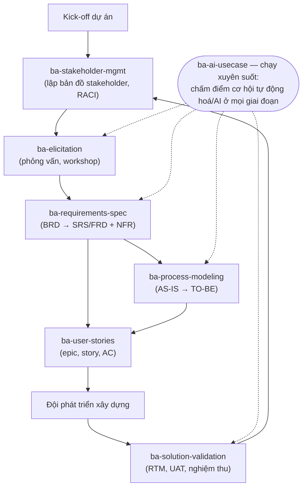
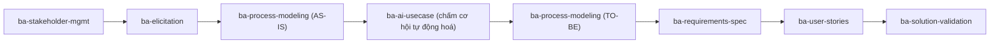
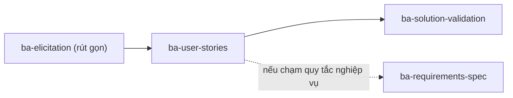

# Playbook — BA doanh nghiệp vận dụng bộ skill `ba-*`

> Tài liệu đồng hành với [`01-agent-skills-huong-dan-truc-quan.md`](./01-agent-skills-huong-dan-truc-quan.md).
> Mục đích: bạn (Agentic AI BA + IT BA) **biết khi nào gọi skill nào**, đưa **đầu vào gì**, nhận
> **đầu ra gì**, và dùng **prompt mẫu** ra sao. Mỗi skill là một mắt xích trong vòng đời dự án.

---

## Bản đồ tổng (một dự án đi qua các skill)

---

## 1. `ba-stakeholder-mgmt` — Quản lý bên liên quan

| Khi nào dùng | Đầu vào bạn cung cấp | Đầu ra |
|---|---|---|
| Đầu dự án & bất cứ lúc nào cần truyền thông | Danh sách phòng ban/cá nhân, mục tiêu dự án, bối cảnh chính trị nội bộ | Bản đồ Power/Interest, ma trận RACI, kế hoạch truyền thông, status report (3P) |

**Prompt mẫu:**
> "Dự án thay hệ thống ERP. Stakeholder gồm: CFO (tài trợ), trưởng phòng kho, IT ops, nhà cung cấp
> phần mềm, kiểm toán nội bộ. Lập bản đồ Power/Interest và ma trận RACI cho các hoạt động chính."

---

## 2. `ba-elicitation` — Khơi gợi yêu cầu

| Khi nào dùng | Đầu vào | Đầu ra |
|---|---|---|
| Trước khi viết spec; khi yêu cầu còn mơ hồ | Đối tượng phỏng vấn, phạm vi, tài liệu hiện có | Kế hoạch phỏng vấn/workshop, bộ câu hỏi mở/đóng, biên bản & danh sách yêu cầu thô đã phân loại |

**Prompt mẫu:**
> "Chuẩn bị buổi phỏng vấn 60 phút với trưởng phòng kho để hiểu quy trình nhập–xuất hiện tại. Soạn
> bộ câu hỏi đi từ tổng quan đến chi tiết, kèm câu hỏi đào sâu các điểm đau (pain point)."

---

## 3. `ba-requirements-spec` — Đặc tả yêu cầu

| Khi nào dùng | Đầu vào | Đầu ra |
|---|---|---|
| Sau khi đã khơi gợi đủ context | Mục tiêu nghiệp vụ, phạm vi, ràng buộc, yêu cầu thô | BRD (góc nhìn nghiệp vụ), SRS/FRD (chức năng chi tiết), danh mục NFR, có mã truy vết REQ-### |

**Prompt mẫu:**
> "Từ biên bản phỏng vấn đính kèm, viết BRD cho hệ thống quản lý kho. Sau đó bóc tách thành SRS với
> yêu cầu chức năng đánh mã REQ-###, kèm danh mục NFR (hiệu năng, bảo mật, khả dụng)."

---

## 4. `ba-process-modeling` — Mô hình hoá quy trình

| Khi nào dùng | Đầu vào | Đầu ra |
|---|---|---|
| Khi cần làm rõ luồng nghiệp vụ, tìm điểm cải tiến | Mô tả quy trình hiện tại, vai trò tham gia | Sơ đồ AS-IS & TO-BE (Mermaid flowchart/swimlane), bảng phân tích gap & cơ hội tự động hoá |

**Prompt mẫu:**
> "Vẽ quy trình AS-IS cho luồng phê duyệt mua hàng (nhân viên → trưởng phòng → mua hàng → kế toán),
> chỉ ra nút thắt, rồi đề xuất TO-BE rút ngắn thời gian phê duyệt."

---

## 5. `ba-user-stories` — User story & backlog

| Khi nào dùng | Đầu vào | Đầu ra |
|---|---|---|
| Khi chuyển yêu cầu thành backlog cho đội Agile | Yêu cầu/đặc tả, persona người dùng | Epic → user story (mẫu "As a… I want… so that…"), tiêu chí chấp nhận Gherkin, kiểm INVEST, gợi ý ưu tiên |

**Prompt mẫu:**
> "Bóc module đăng nhập SSO thành epic + user story, mỗi story có tiêu chí chấp nhận dạng
> Given/When/Then. Đánh dấu story nào chưa đạt INVEST và đề xuất tách nhỏ."

---

## 6. `ba-solution-validation` — Kiểm thử & nghiệm thu

| Khi nào dùng | Đầu vào | Đầu ra |
|---|---|---|
| Trước go-live; khi cần chứng minh "đã làm đúng yêu cầu" | Danh sách yêu cầu (REQ-###), user story | Ma trận truy vết (RTM) yêu cầu→story→test, kịch bản UAT, gap analysis, biên bản nghiệm thu |

**Prompt mẫu:**
> "Lập ma trận truy vết từ các REQ-### trong SRS xuống user story và ca kiểm thử UAT. Chỉ ra yêu cầu
> nào chưa có test che phủ."

---

## 7. `ba-ai-usecase` — Phát hiện & đánh giá use-case AI/Agentic AI

| Khi nào dùng | Đầu vào | Đầu ra |
|---|---|---|
| Khi cân nhắc đưa AI/tự động hoá vào quy trình | Quy trình/điểm đau, dữ liệu sẵn có, mục tiêu | Khung chấm điểm cơ hội (giá trị × khả thi), đánh giá mức sẵn sàng dữ liệu, thiết kế human-in-the-loop, ma trận rủi ro, đề xuất MVP |

**Prompt mẫu:**
> "Quy trình xử lý hoá đơn đang thủ công, 2.000 hoá đơn/tháng, sai sót ~5%. Đánh giá đây có phải
> use-case tốt cho Agentic AI không: chấm giá trị/khả thi, mức sẵn sàng dữ liệu, điểm cần
> human-in-the-loop, rủi ro, và đề xuất phạm vi MVP."

---

## Ghép skill theo kịch bản thực tế

**Kịch bản A — "Số hoá một quy trình giấy tờ":**

**Kịch bản B — "Thêm tính năng vào sản phẩm có sẵn":**

---

## Mẹo phối hợp với các skill gốc của repo

| Cần gì | Dùng kèm skill gốc |
|---|---|
| Xuất BRD/SRS thành file Word đẹp | `docx` |
| Trình bày kết quả phân tích cho lãnh đạo | `pptx` + `theme-factory` |
| Bảng dữ liệu/RTM dưới dạng Excel | `xlsx` |
| Viết thông báo nội bộ về dự án | `internal-comms` |
| Đồng-soạn tài liệu dài có quy trình review | `doc-coauthoring` |
| Tạo thêm skill BA mới cho quy ước riêng công ty | `skill-creator` |

> Nguyên tắc: **skill `ba-*` lo phần "nội dung & tư duy nghiệp vụ"; skill gốc lo phần "định dạng &
> kênh truyền tải".** Ghép lại bạn có chuỗi từ phỏng vấn → tài liệu hoàn chỉnh → trình bày.
