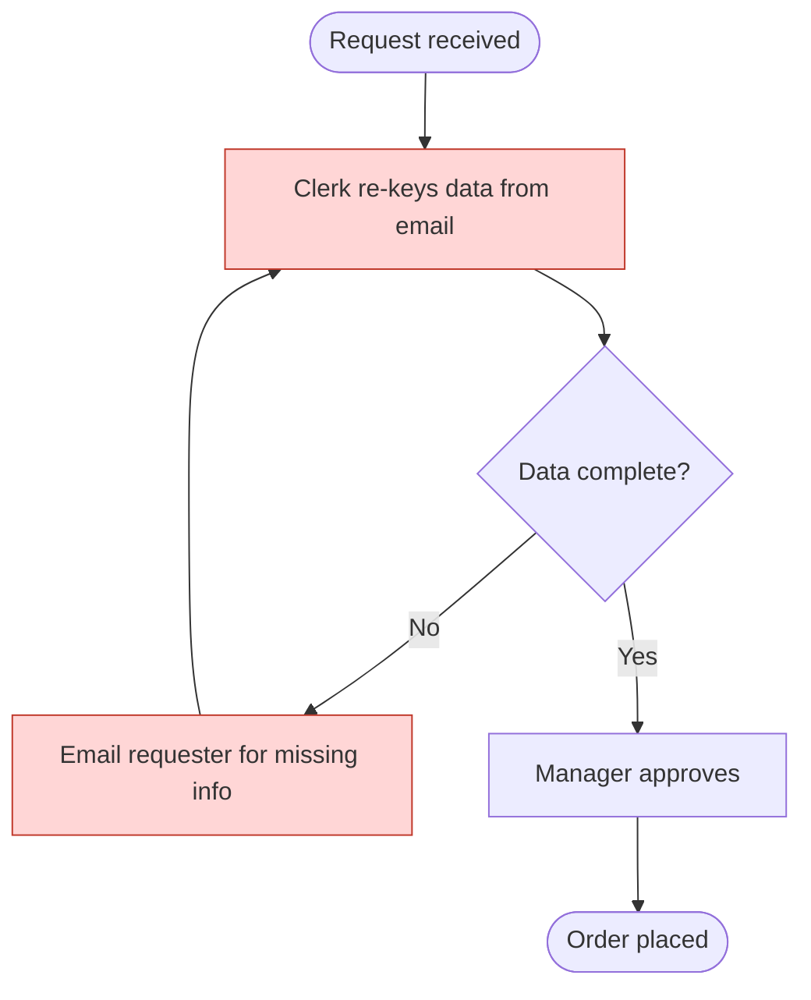
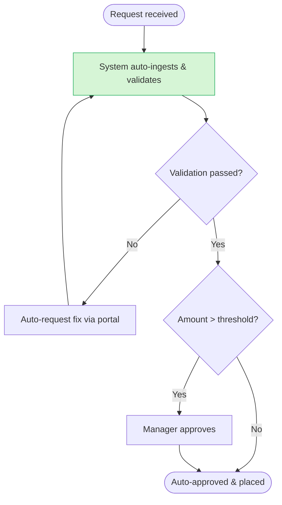

# BA Process Modeling

A process model makes an invisible thing — how work actually flows — visible enough to fix. The two
deliverables that matter most are **AS-IS** (an honest picture of how things work today, warts and
all) and **TO-BE** (the redesigned target). The value is in the *delta* between them: that's where
the improvement, the requirements, and the business case live.

Use **Mermaid** for diagrams: it's text, so it versions in git, renders on GitHub, and is easy to
revise. For the full Mermaid pattern library (decisions, loops, sub-processes, swimlanes, styling),
read `references/mermaid-patterns.md`.

## Core notation (keep it readable)

Map real-world process elements to consistent shapes:

| Element | Mermaid shape | Use for |
|---|---|---|
| Start / End | `([Start])` stadium | process boundaries |
| Activity / task | `[Do the thing]` rectangle | a step someone performs |
| Decision | `{Approved?}` diamond | a branch / gateway |
| Document / data | `[/Invoice/]` parallelogram | an input/output artifact |
| Sub-process | `[[Sub-process]]` | a step detailed elsewhere |

For **who does what**, use a swimlane (`subgraph` per role/system). Cross-lane arrows expose
hand-offs — and hand-offs are where delay and errors hide.

## Workflow

### 1. Establish boundaries and actors
Pin down the **trigger** (what starts the process), the **outcome** (what "done" looks like), and the
**actors** (roles/systems involved). A model without clear start/end sprawls forever.

### 2. Draw AS-IS honestly
Capture reality, not the official SOP. Include the workarounds, the manual re-keying, the "email the
spreadsheet" steps. An AS-IS that's too clean hides the very problems you're there to solve. Mark
pain points visibly (a styled node or a 🔴 annotation).

### 3. Analyze the gap
For each pain point, identify the cause and the cost (time, errors, rework, risk). Categorize the
fix: **eliminate** (remove the step), **simplify**, **automate**, or **integrate**. This is the
analytical core — don't jump to TO-BE without it.

### 4. Design TO-BE
Redraw the process with the fixes applied. Show clearly what changed and *why*. Don't just digitize
a bad process — question whether each step should exist at all (eliminate before automate).

### 5. Summarize the change
Produce a short gap table: pain point → change → expected benefit → requirements it generates. These
requirements feed `ba-requirements-spec`; automation candidates feed `ba-ai-usecase`.

## Output format

```markdown
## AS-IS: [process name]
[Mermaid swimlane diagram]

### Pain points
| # | Step | Problem | Cost |
|---|------|---------|------|
| 1 | Manual data entry | re-keyed from email | ~2h/day, 5% error |

## TO-BE: [process name]
[Mermaid swimlane diagram]

### Gap analysis & changes
| Pain | Change (eliminate/simplify/automate/integrate) | Benefit | Generates requirement |
|------|-----------------------------------------------|---------|------------------------|
| 1 | Automate via OCR + validation | save 2h/day, errors < 1% | FR for ingestion, ba-ai-usecase candidate |
```

## Example: a minimal AS-IS / TO-BE pair





## Guardrails

- Don't model fiction. If you don't know a step, mark it `[?? verify with <role>]` rather than
  inventing a clean flow.
- Keep diagrams legible. If a flow exceeds ~15–20 nodes, break out sub-processes — a wall of boxes
  communicates nothing.
- Eliminate before you automate. Automating a wasteful step just makes waste faster; always ask
  "should this step exist?" in the gap analysis.
