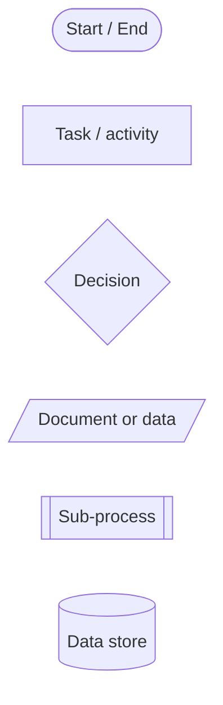
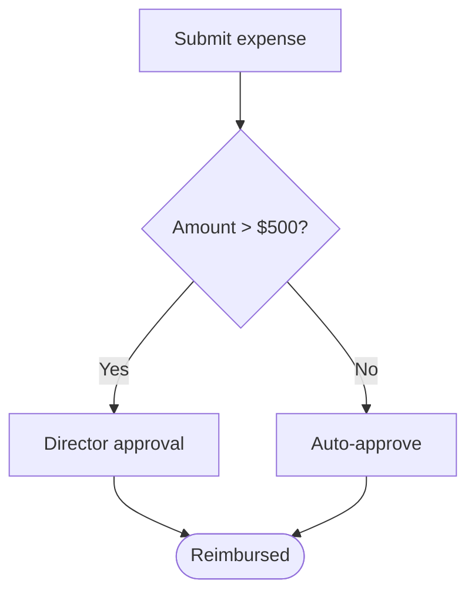
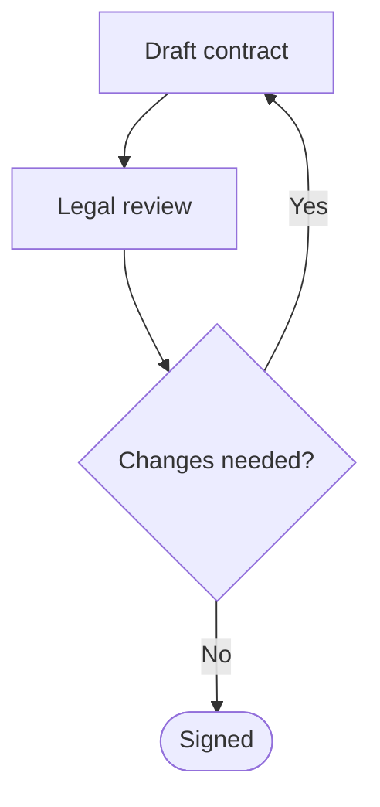
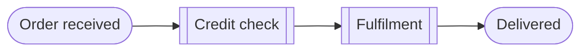
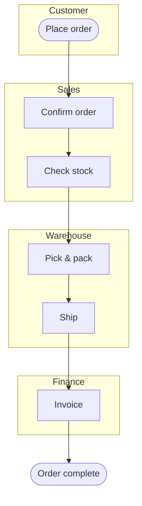
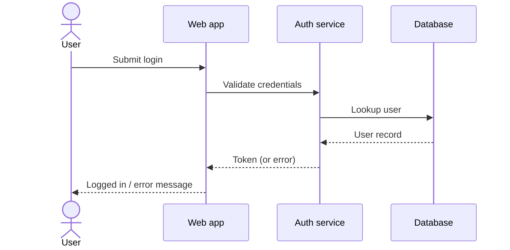
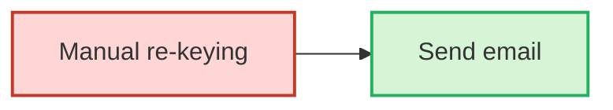

# Mermaid Patterns for Process Modeling — Reference

Copy-adapt these patterns. They render on GitHub and in most Markdown viewers. Read when you need a
shape, a swimlane, a loop, or styling you don't remember.

## Table of contents
1. Node shapes (process notation)
2. Decisions and branches
3. Loops and rework
4. Sub-processes
5. Swimlanes (cross-functional)
6. Sequence diagram (for system interactions)
7. Styling pain points / changes
8. Common mistakes

---

## 1. Node shapes

---

## 2. Decisions and branches

Label *every* branch from a decision. An unlabeled branch is ambiguous.

---

## 3. Loops and rework

Rework loops are often the real cost in a process — show them explicitly.

---

## 4. Sub-processes

Keep the top level readable; detail heavy steps separately.

Then detail `Credit check` in its own diagram.

---

## 5. Swimlanes (cross-functional)

Use `subgraph` per actor. Cross-lane arrows = hand-offs (watch these for delay/error).

> Tip: Mermaid `flowchart` swimlanes are approximate. For strict BPMN pools/lanes you'd use a BPMN
> tool, but for BA communication this is usually enough and stays in version control.

---

## 6. Sequence diagram (system interactions)

When the question is "which system calls which, in what order", a sequence diagram beats a flowchart.

---

## 7. Styling pain points / changes

Convention: red = pain/removed, green = new/improved, yellow = needs verification.

---

## 8. Common mistakes

- **No start/end** → the process looks like it floats. Always bound it.
- **Unlabeled decision branches** → ambiguous logic.
- **Hidden rework loops** → you miss the biggest cost. Draw the loop back.
- **One giant diagram** → unreadable. Use sub-processes past ~15–20 nodes.
- **Modeling the SOP, not reality** → the AS-IS must include the workarounds.
